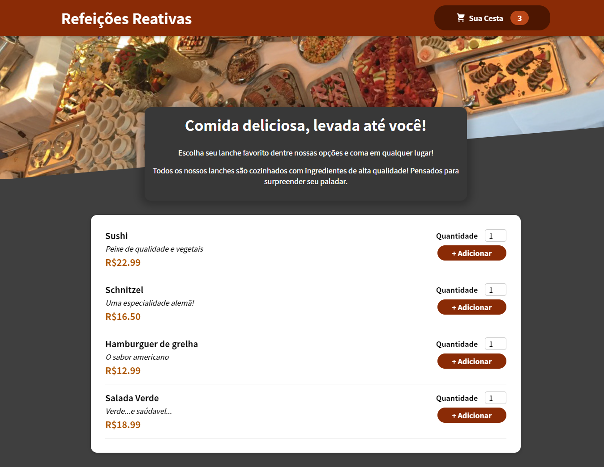
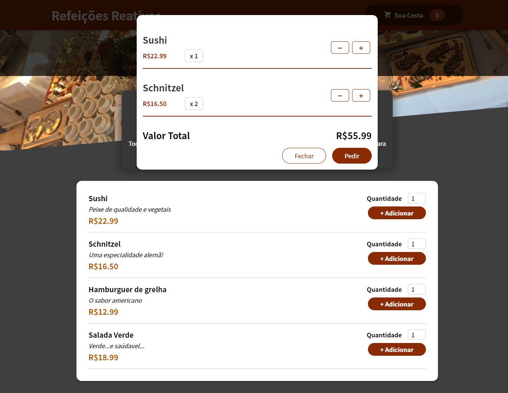

# Refeições Reativas

## Descrição

Um cardápio digital que utiliza React para controlar estados no carrinho de compras

## Detalhes

● Criei uma aplicação em React para servir como um cardápio dinâmico e mockup para um futuro freelance de
restaurantes.

● Implementei stores utilizando ContextAPI para gerenciamento de estados globais e melhor performance da página.

## Link para acesso

- https://refeicoes-reativas.vercel.app/

## Prévia

